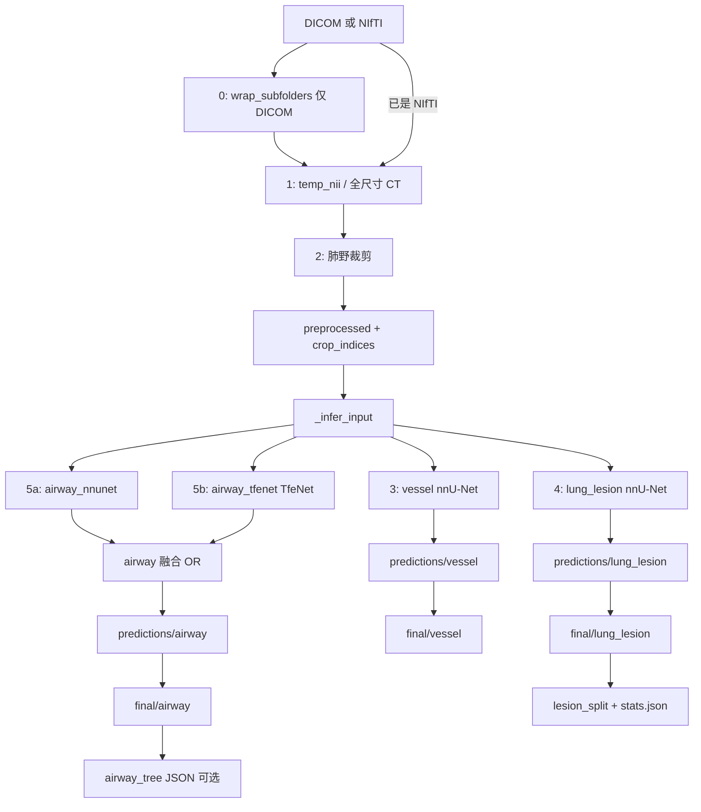

# 肺部一键分割流水线说明

本文档说明如何使用仓库中的 **统一分割流水线**，从 **DICOM 或 NIfTI** 输入，一次性完成 **气道、血管、病灶** 分割，并按固定目录结构输出结果。

---

## 目录

1. [功能概览](#1-功能概览)
2. [输出目录结构](#2-输出目录结构)
3. [环境准备](#3-环境准备)
4. [配置文件](#4-配置文件)
5. [快速开始](#5-快速开始)
6. [命令行参数](#6-命令行参数)
7. [处理流程](#7-处理流程)
8. [各任务说明](#8-各任务说明)
9. [项目文件结构](#9-项目文件结构)
10. [常见问题](#10-常见问题)

---

## 1. 功能概览

| 任务 | 模型 | 说明 |
|------|------|------|
| **airway**（气管） | nnU-Net + TfeNet + TfeNetSmall | nnU-Net 气管 → TfeNet 双模型并集 → 体素级 OR 融合 → 后处理 |
| **vessel**（血管） | nnU-Net v2 `3d_fullres` | 需在配置中指定 Dataset ID |
| **lung_lesion**（病灶） | nnU-Net v2 `3d_fullres` | 同上；支持拆分为独立病灶并生成统计 |

**流水线自动完成：**

- DICOM 目录结构整理（`wrap_subfolders`，仅 DICOM 输入时）
- DICOM → NIfTI（**SimpleITK / `dicom_to_nii.py`**，保留 Origin / Spacing / Direction）
- 肺野裁剪（`lungmask` 或 HU 回退）
- 在裁剪空间推理 → 贴回原始 CT 尺寸
- 病灶连通域拆分（`lesion_001.nii.gz` … + `stats.json`）
- 气道树 JSON 导出（可选）
- 批量模式（`--batch`）：一次处理根目录下多个病例

**入口脚本：**

```text
run_segmentation_pipeline.py    # 推荐
python -m pipeline                # 等价
```

---

## 2. 输出目录结构

每个病例在 `output_dir/{case_name}/` 下生成如下结构：

```text
output_dir/{case_name}/
│
├── temp_nii/                          # 临时 NIfTI（DICOM 转换或标准化）
│   └── {case_name}_0000.nii.gz
│
├── preprocessed/                      # 预处理（肺野裁剪后）
│   ├── {case_name}_0000.nii.gz
│   └── {case_name}_crop_indices.json  # 裁剪框，用于贴回全图
│
├── _infer_input/                      # 内部用：仅含 CT，供模型读取
│   └── {case_name}_0000.nii.gz
│
├── predictions/                       # 推理结果（裁剪空间）
│   ├── airway_nnunet/                 # nnU-Net 气管
│   ├── airway_tfenet/
│   │   ├── TfeNet/                    # TfeNet 全气道
│   │   ├── TfeNetSmall/               # TfeNet 细气道（可选）
│   │   └── {case}.nii.gz              # 两路并集
│   ├── airway/                        # 最终融合 + 后处理前（裁剪空间）
│   ├── lung_lesion/
│   └── vessel/
│
└── final/                             # 最终结果（原始 CT 尺寸）
    ├── lung_lesion/
    │   └── {case_name}.nii.gz
    ├── airway/
    │   └── {case_name}.nii.gz
    ├── vessel/
    │   └── {case_name}.nii.gz
    ├── lesion_split/                  # 病灶拆分（仅 lung_lesion）
    │   └── {case_name}/
    │       ├── lesions/
    │       │   ├── lesion_001.nii.gz
    │       │   ├── lesion_002.nii.gz
    │       │   └── ...
    │       └── stats.json
    └── airway_tree/                   # 可选
        └── {case_name}_tree.json
```

### `crop_indices.json` 字段说明

| 字段 | 含义 |
|------|------|
| `case_name` | 病例名 |
| `original_shape_zyx` | 原始体数据形状（Z, Y, X） |
| `crop_box_zyx` | 裁剪范围 `{z, y, x}` 各为 `[min, max)` |
| `reference_ct` | 全尺寸参考 CT 路径（`temp_nii` 下） |
| `origin` / `spacing` / `direction` | 参考图像物理信息 |

### `stats.json`（病灶拆分）

包含每个病灶的体素数、体积（mm³）、质心、包围盒等，见 `pipeline/lesion_split.py`。

---

## 3. 环境准备

### 3.1 Python 依赖

```bash
cd /path/to/nnunet
pip install -r requirements.txt
pip install nnunetv2          # 血管、病灶推理（必需）
pip install lungmask          # 推荐：肺野裁剪更准确
```

| 包 | 用途 |
|----|------|
| `SimpleITK` | **DICOM → NIfTI**（`dicom_to_nii.py`）、读写 NIfTI、裁剪、贴回 |
| `PyYAML` | 读取 `pipeline_config.yaml` |
| `nnunetv2` | 血管 / 病灶 / 可选气道 nnU-Net |
| `torch` | TfeNet 推理（需自行安装，见下） |
| `lungmask` | 可选，肺野 mask |
| `dcm2niix` | 可选；流水线**不再使用**，仅作独立转换工具时需要 |

### 3.2 TfeNet（气道）额外步骤

气道分割依赖 **TfeNet** 的 CUDA 扩展与预训练权重：

```bash
# 1. PyTorch（示例，按本机 CUDA 版本选择）
pip install torch torchvision --index-url https://download.pytorch.org/whl/cu121

# 2. 编译 DAConv / DSConv（在 TfeNet 目录下）
cd TfeNet/DAConv && python setup.py install
cd ../DSConv && python setup.py install

# 3. 下载权重到 TfeNet/checkpoint/（见 TfeNet/README.md）
#    AIIB23/TfeNet_checkpoint.ckpt
#    AIIB23/TfeNetSmall_checkpoint.ckpt
```

### 3.3 nnU-Net 环境变量

```bash
# Linux / macOS
export nnUNet_results=/path/to/nnUNet_results

# Windows PowerShell
$env:nnUNet_results = "D:\nnUNet_results"
```

或在 `pipeline_config.yaml` 中设置 `nnunet_results`。

训练好的模型目录应类似：

```text
nnUNet_results/
├── Dataset502_YourVessel/
│   └── nnUNetTrainer__nnUNetPlans__3d_fullres/
└── Dataset503_YourLesion/
    └── nnUNetTrainer__nnUNetPlans__3d_fullres/
```

---

## 4. 配置文件

编辑仓库根目录的 `pipeline_config.yaml`（或复制一份后修改路径与 `cuda_id`）。

### 4.1 主要配置项

| 配置项 | 说明 | 默认值 |
|--------|------|--------|
| `nnunet_results` | nnU-Net 训练结果根目录 | 环境变量 |
| `device` | `cuda` 或 `cpu` | `cuda` |
| `cuda_id` | GPU 编号（从 0 起）；TfeNet 与 nnU-Net Python API 均映射为 `cuda:{id}` | `0` |
| `tasks` | 要运行的任务列表 | 三项全开 |
| `crop_lung` | 是否肺野裁剪 | `true` |
| `crop_margin` | 裁剪框外扩体素 | `5` |
| `use_lungmask` | 使用 lungmask 估计肺野 | `true` |
| `airway.checkpoint_dataset` | TfeNet 权重子目录 | `AIIB23` |
| `nnunet_weights_root` | 自定义权重根目录（如 `./weight`） | 推荐 |
| `vessel.model_folder` | 血管模型显式路径 | 可选 |
| `vessel.dataset_id` | 标准 nnU-Net 目录下的 Dataset 编号 | 与 `nnunet_results` 配合 |
| `lung_lesion.dataset_id` | 病灶 Dataset 编号 | 同上 |
| `postprocess_airway_iou_with_nnunet` | 融合 mask 与 nnU-Net 气管做 IoU 过滤 | `true` |
| `postprocess_airway_iou_threshold` | IoU 连通域保留阈值 | `0.3` |
| `split_lesions` | 是否拆分独立病灶 | `true` |
| `export_airway_tree` | 是否导出气道树 JSON | `false` |

### 4.2 `dataset_id` 是什么？

`dataset_id` 仅在使用 **nnU-Net 官方目录布局** 时生效。流水线会在 `nnunet_results` 下自动查找：

```text
nnUNet_results/Dataset{ID:03d}_任意名称/nnUNetTrainer__nnUNetPlans__3d_fullres/
```

例如 `dataset_id: 502` → 匹配 `Dataset502_MyVessel/...`。

若你的权重是自定义文件夹（如 `weight/vessel/...`），**不要填 `dataset_id`**，改用下面两种方式之一：

- **`nnunet_weights_root: "./weight"`**（推荐，已支持）
- 或每个任务写 **`model_folder: "./weight/vessel/nnUNetTrainer__nnUNetPlans__3d_fullres"`**

### 4.3 示例：`weight/` 目录结构

```yaml
nnunet_weights_root: "./weight"

vessel:
  configuration: 3d_fullres
  folds: all

lung_lesion:
  configuration: 3d_fullres
  folds: all

airway:
  use_nnunet_fusion: true
  checkpoint_dataset: AIIB23
  use_small: true

airway_nnunet:
  weights_subdir: airway
  configuration: 3d_fullres
```

对应磁盘路径：

```text
weight/airway/nnUNetTrainer__nnUNetPlans__3d_fullres/
weight/vessel/nnUNetTrainer__nnUNetPlans__3d_fullres/
weight/lung_lesion/nnUNetTrainer__nnUNetPlans__3d_fullres/
```

多类 nnU-Net 输出时，可指定前景 label，例如：

```yaml
vessel:
  dataset_id: 502
  foreground_labels: [1]
```

---

## 5. 快速开始

### 5.0 输入路径与输出目录

| 输入形式 | 示例 | 病例名 | 输出根目录（默认） |
|----------|------|--------|-------------------|
| DICOM 目录 | `.../case001/dicom` | `case001` | `case001` 的**上级目录** |
| 病例根目录 | `.../case001`（内含 `dicom/`） | `case001` | 同上 |
| 单个 NIfTI | `.../ct.nii.gz` | 文件名（可 `--case_name` 覆盖） | NIfTI 所在目录 |
| 批量根目录 | `.../CT_5_20`（多个病例子文件夹） | 各子文件夹名 | 批量根目录本身 |

`--output_dir` **可省略**：未指定时按上表自动推断。`preprocessed/`、`final/` 等写在 `output_dir/{case_name}/` 下，与 `dicom/` 同级。

识别为数据子目录的名称（不区分大小写）：`dicom`、`dicoms`、`dcm`、`images`、`nifti`、`nii`、`scans`、`scan`。

### 5.1 DICOM 文件夹（最常见）

```powershell
cd C:\Users\mamah\PycharmProjects\nnunet

# 仅需 --input；输出落在 case001/ 下（与 dicom/ 同级）
python run_segmentation_pipeline.py `
  --input D:\data\CT_5_20\case001\dicom `
  --config pipeline_config.yaml

# 或显式指定输出根目录
python run_segmentation_pipeline.py `
  --input D:\data\CT_5_20\case001\dicom `
  --output_dir D:\output `
  --config pipeline_config.yaml
```

DICOM 输入时，流水线第 0 步会自动调用 `wrap_subfolders`：将 `case001/*` 整理为 `case001/case001/*`（若尚未是该结构），便于多层级 DICOM 目录。

### 5.2 单个 NIfTI 文件

```powershell
python run_segmentation_pipeline.py `
  --input D:\data\ct.nii.gz `
  --case_name case001 `
  --config pipeline_config.yaml
```

### 5.3 仅运行部分任务

```powershell
# 只做血管 + 病灶
python run_segmentation_pipeline.py `
  --input D:\data\dicom\case001 `
  --output_dir D:\output `
  --config pipeline_config.yaml `
  --tasks vessel,lung_lesion

# 只做气道
python run_segmentation_pipeline.py `
  --input D:\data\dicom\case001 `
  --output_dir D:\output `
  --tasks airway
```

### 5.4 导出气道树 JSON

```powershell
python run_segmentation_pipeline.py `
  --input D:\data\dicom\case001 `
  --output_dir D:\output `
  --config pipeline_config.yaml `
  --airway_tree
```

或在配置文件中设置 `export_airway_tree: true`。

### 5.5 批量处理多个病例

```powershell
python run_segmentation_pipeline.py `
  --input D:\data\CT_5_20 `
  --batch `
  --config pipeline_config.yaml
```

`--input` 为含多个病例子文件夹的根目录；`--batch` 时**不能**使用 `--case_name`。某一病例失败不会中断其余病例，结束时汇总成功/失败列表。

### 5.6 单独转换 DICOM（不跑分割）

```powershell
python dicom_to_nii.py
```

在脚本底部修改 `input_dicom_directory` 与 `output_nifti_file`，或在其他代码中调用：

```python
from dicom_to_nii import convert_dicom_to_nifti
convert_dicom_to_nifti(r"D:\data\dicom", r"D:\data\out.nii.gz")
```

多序列时自动选择**层数最多**的序列；子目录搜索由 `pipeline/dicom.py` 的 `_find_dicom_series_dir` 负责（流水线内 `recursive=True`）。

---

## 6. 命令行参数

| 参数 | 必填 | 说明 |
|------|------|------|
| `--input` | 是 | DICOM 目录、NIfTI 文件、含 NIfTI 的目录；配合 `--batch` 时为多病例根目录 |
| `--batch` | 否 | 批量模式：处理 `--input` 下每个子文件夹为一个病例 |
| `--output_dir` | 否 | 输出根目录（其下创建 `{case_name}/...`）；默认按输入路径自动推断 |
| `--case_name` | 否 | 病例名；默认取输入文件夹名；`.../{case}/dicom` 时取 `{case}`；**批量模式不可用** |
| `--config` | 否 | YAML 配置文件路径（默认 `pipeline_config.yaml`） |
| `--tasks` | 否 | 逗号分隔：`airway,vessel,lung_lesion` |
| `--cuda_id` | 否 | 覆盖配置中的 GPU 编号（如 yaml 为 `7` 则 PyTorch 使用 `cuda:7`） |
| `--no_crop` | 否 | 禁用肺野裁剪 |
| `--no_lesion_split` | 否 | 不拆分独立病灶 |
| `--airway_tree` | 否 | 导出气道树 JSON |
| `--no_airway_tree` | 否 | 强制不导出气道树 |

查看帮助：

```bash
python run_segmentation_pipeline.py --help
```

---

## 7. 处理流程



**步骤说明：**

0. **整理 DICOM 目录（仅 DICOM 输入）**  
   - 调用 `wrap_subfolders`：每个病例子目录内增加一层同名内层目录  
   - 例：`case001/file.dcm` → `case001/case001/file.dcm`  
   - 可单独预运行：`python wrap_subfolders.py "D:/data/CT_5_20"`

1. **准备 NIfTI**  
   - DICOM：`dicom_to_nii.py`（SimpleITK GDCM）→ `pipeline/dicom.py`  
   - 递归搜索子目录（默认深度 5），多序列时选**层数最多**的序列  
   - 保留 Origin / Spacing / Direction，写出 `temp_nii/{case_name}_0000.nii.gz`  
   - 已有 NIfTI：复制或选体积最大文件后标准化命名

2. **肺野预处理**  
   - 优先 `lungmask`；未安装则用 HU 阈值估计  
   - 写出裁剪后 CT 与 `crop_indices.json`  
   - `--no_crop` 时跳过裁剪，crop 框为全图

3. **nnU-Net 推理**（血管、病灶）  
   - 输入：`_infer_input/{case}_0000.nii.gz`  
   - 输出：`predictions/{task}/{case}.nii.gz`  
   - 再贴回全图 → `final/{task}/`

4. **气管（airway）**  
   - **4a** nnU-Net：`weight/airway/` → `predictions/airway_nnunet/`  
   - **4b** TfeNet 全气道 + 细气道并集 → `predictions/airway_tfenet/`  
   - **融合**：`(nnU-Net ∪ TfeNet) > 0` → `predictions/airway/`  
   - IoU 过滤：pred=融合 mask，reference=nnU-Net 气管；再最大连通域后处理

5. **后处理**  
   - 病灶：连通域拆分 → `final/lesion_split/`  
   - 气道：可选骨架树统计 → `final/airway_tree/`

---

## 8. 各任务说明

### 8.1 气管（airway）

**配置（`pipeline_config.yaml`）：**

```yaml
airway:
  use_nnunet_fusion: true      # 开启 nnU-Net ∪ TfeNet

airway_nnunet:
  weights_subdir: airway       # → weight/airway/nnUNetTrainer__...
  configuration: 3d_fullres
```

- **nnU-Net**：`airway_nnunet` → `weight/airway/`
- **TfeNet**：`TfeNet/checkpoint/{AIIB23|ATM22|BAS}/` 下两个 ckpt，`airway.use_small: true` 时跑细气道
- **仅 TfeNet、不用 nnU-Net**：设 `use_nnunet_fusion: false`，并删除或注释 `airway_nnunet` 块
- **后处理**：融合后 `(TfeNet∪nnU-Net)` 相对 `airway_nnunet` 做 IoU 过滤，再 `postprocess_airway_lcc` 最大连通域

单独调试 TfeNet 可参考：

```bash
cd TfeNet
python evaluation.py --data-path /path/to/CT --gpu 1 --checkpoint-dataset AIIB23
```

### 8.2 血管（vessel）

- **模型**：nnU-Net v2，通过 `vessel.dataset_id` 或 `vessel.model_folder` 指定
- **单独推理**：

```bash
python nnunet/nnunet_predict_3d_fullres.py \
  --dataset_id 502 \
  --input_folder /path/to/_infer_input \
  --output_folder /path/to/out \
  --cuda_id 0
```

### 8.3 病灶（lung_lesion）

- 与血管相同，使用 `lung_lesion.dataset_id`
- 拆分后每个连通域保存为 `lesion_XXX.nii.gz`，`stats.json` 记录体积与位置

### 8.4 输入格式要求

| 输入类型 | 要求 |
|----------|------|
| DICOM 目录 | 可含子目录；建议平扫 CT 单序列；支持无扩展名 DICOM 文件 |
| 病例布局 | 推荐 `.../{case_name}/dicom/...`，流水线自动识别 `case_name` |
| NIfTI 文件 | `.nii` / `.nii.gz` |
| NIfTI 目录 | 多文件时选体积最大者 |

nnU-Net 输入命名须为 `{case_id}_0000.nii.gz`，流水线会自动处理。

### 8.5 GPU 与 `cuda_id`

- 配置 `device: cuda` + `cuda_id: N` 时，启动日志会打印：`推理设备: cuda, cuda_id=N (PyTorch: cuda:N)`  
- **TfeNet**：`evaluation.py` 使用 `cuda:N`  
- **nnU-Net CLI**：子进程设置 `CUDA_VISIBLE_DEVICES=N`  
- **nnU-Net Python API**（自定义 `weight/` 路径）：`torch.device("cuda:N")`  
- 命令行 `--cuda_id 0` 可临时覆盖 yaml；`device: cpu` 时忽略 `cuda_id`  
- 单机通常设 `cuda_id: 0`；`cuda_id: 7` 表示第 8 块 GPU，需机器上确有该编号

---

## 9. 项目文件结构（精简后）

```text
nnunet/
├── run_segmentation_pipeline.py     # 入口 → pipeline.runner
├── dicom_to_nii.py                  # SimpleITK DICOM → NIfTI（流水线使用）
├── wrap_subfolders.py               # DICOM 目录结构整理（流水线第 0 步）
├── requirements.txt
├── pipeline_config.yaml             # 本机配置（可复制后修改）
├── PIPELINE.md
├── pipeline/
│   ├── runner.py                    # 单例 / 批量流水线
│   ├── dicom.py                     # 调用 dicom_to_nii + 递归找序列
│   ├── config.py                    # cuda_id / torch_device 等
│   └── ...
├── nnunet/
│   └── nnunet_predict_3d_fullres.py
└── TfeNet/                          # 仅推理相关
    ├── evaluation.py
    ├── postprocessing.py
    ├── data_ATM22.py                # SegValData（推理数据加载）
    ├── utils.py
    ├── win_dll_fix.py
    ├── TfeNet.py
    ├── gt_skeleton_tree_parsing.py  # 仅 --airway_tree 时需要
    ├── model/TfeNet_model.py
    ├── DAConv/                      # 需 setup.py install
    ├── DSConv/
    ├── checkpoint/                  # 权重（需自行下载）
    └── README.md
```

单独调试气道：

```bash
cd TfeNet
python evaluation.py --data-path /path/to/CT --gpu 1 --checkpoint-dataset AIIB23
```

---

## 10. 常见问题

| 现象 | 可能原因 | 处理 |
|------|----------|------|
| `No module named 'yaml'` | 未安装 PyYAML | `pip install PyYAML` |
| `No module named 'nnunetv2'` | 未安装 nnU-Net | `pip install nnunetv2` |
| `未找到权重文件: .../checkpoint/...` | TfeNet 权重未下载 | 按 TfeNet/README 放到 `checkpoint/AIIB23/` |
| `No module named 'DACONV_CUDA'` | CUDA 扩展未编译 | 在 TfeNet 环境内编译 DAConv / DSConv |
| `未找到模型: Dataset502_*` | Dataset ID 或路径错误 | 检查 `nnunet_results` 与 `dataset_id` |
| `nnUNet_results 未设置` | 环境变量与配置均未指定 | 设置 `nnUNet_results` 或写入 yaml |
| DICOM 转换失败 | 路径无 DICOM 或序列在深层子目录 | 确认 `--input`；流水线会递归搜索（深度 5） |
| 转换出多个 NIfTI | 多序列共存 | 选层数最多的序列；建议目录内只保留目标 CT |
| 可视化/坐标“偏移” | 忽略 NIfTI direction 矩阵 | 勿用 `index * spacing + origin`；须用完整 affine（Y 轴常为 -1 属正常 LPS→RAS） |
| wrap 后路径混乱 | 手动改过目录结构 | 可单独运行 `wrap_subfolders.py --dry_run` 预览；已是 `case/case/` 结构会跳过 |
| nnU-Net 跑在 GPU 0 | 自定义权重走 Python API 且旧版未传 cuda_id | 已修复：确认日志为 `device=cuda:N`；或 `--cuda_id N` |
| `cuda_id` 越界 | 配置编号大于本机 GPU 数 | `nvidia-smi` 后改为 `0` 或实际编号 |
| 气道与血管形状不一致 | 裁剪/贴回异常 | 检查 `crop_indices.json` 与 `temp_nii` 是否同一病例 |
| lungmask 安装失败 | 环境冲突 | 设 `use_lungmask: false`，改用 HU 估计 |
| 仅 CPU 机器 | 无 CUDA | 配置 `device: cpu`（推理较慢） |

### 仅重跑某一阶段

流水线当前为 **全流程执行**，若需复用已有 `preprocessed/`，可：

1. 暂时在配置中关闭其它 `tasks`，只保留目标任务；或  
2. 直接调用子模块（如 `nnunet/nnunet_predict_3d_fullres.py`、`TfeNet/evaluation.py`）手动指定输入输出路径。

---

## 附录：最小检查清单

运行前请确认：

- [ ] `pipeline_config.yaml` 中 `vessel`、`lung_lesion` 的 `dataset_id` 已改为你的模型  
- [ ] `nnUNet_results` 路径正确，且存在对应 `DatasetXXX_*` 文件夹  
- [ ] TfeNet 权重已放入 `TfeNet/checkpoint/AIIB23/`（若跑 airway）  
- [ ] DAConv / DSConv 已在当前 Python 环境中编译安装  
- [ ] GPU 驱动与 PyTorch CUDA 版本匹配  

完成以上检查后，执行：

```bash
python run_segmentation_pipeline.py --input <你的DICOM或NIfTI> --config pipeline_config.yaml
# 可选：--output_dir <输出根目录>  --cuda_id 0  --batch（多病例根目录）
```

结果将写入 `<输出根目录>/<case_name>/final/`（未指定 `--output_dir` 时按第 5.0 节自动推断）。
